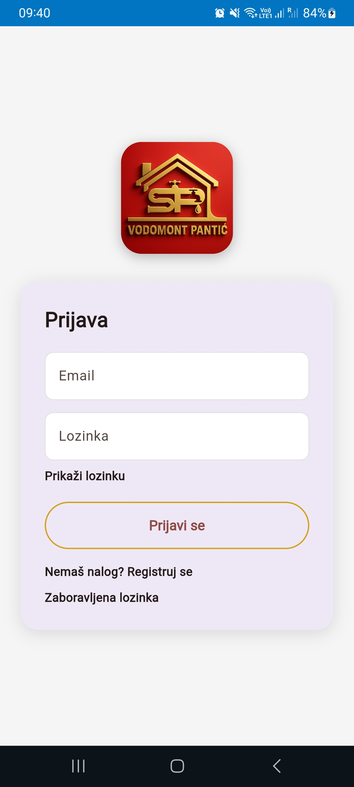
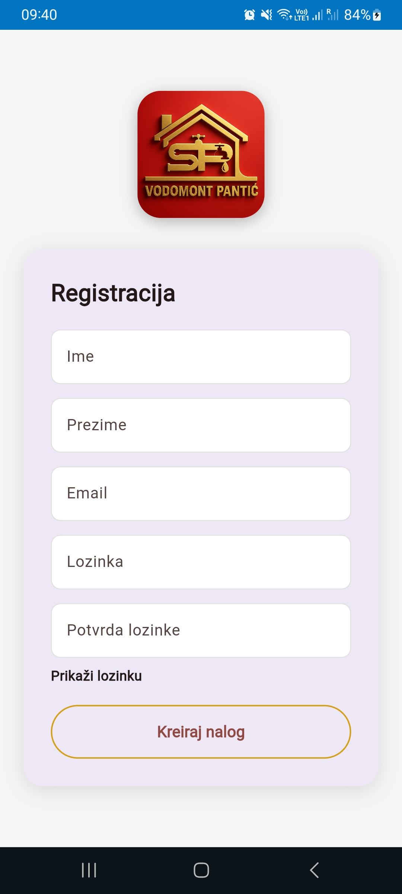
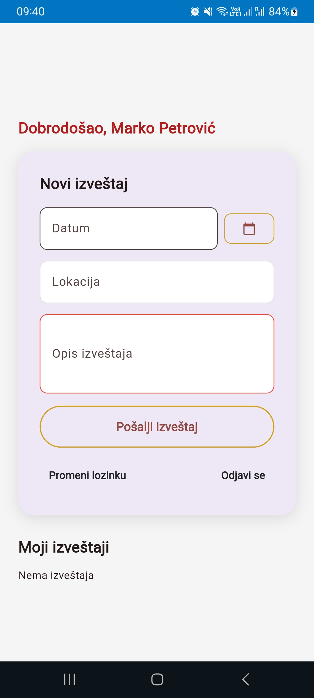
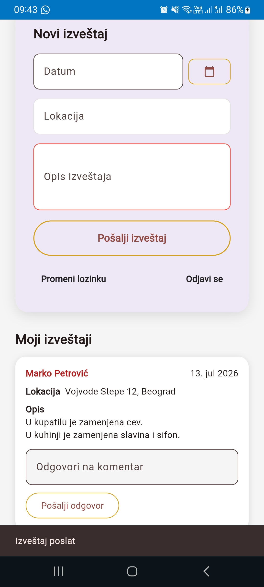
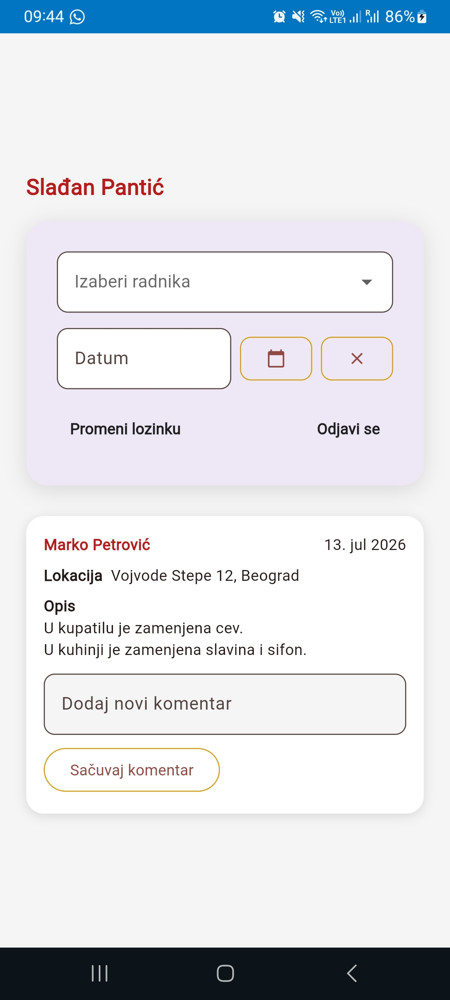
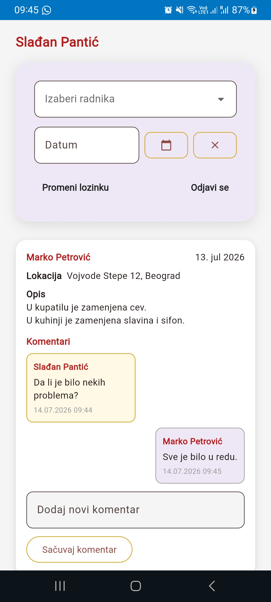

# Vodomont Pantić — Daily Reports App

*[Srpski opis ispod / Serbian description below](#vodomont-pantić--aplikacija-za-dnevne-izveštaje)*

A mobile and web application for managing daily work reports between employees and their employer, built with **Flutter** and a **Firebase** backend. Workers log what they did during the day, while the employer gets an overview of all reports with filtering and in-report communication through comments.

🔗 **Live app:** [https://vodomont-pantic.web.app](https://vodomont-pantic.web.app)

---
## Screenshots

  
  
  

  
  
  

---

## About

The app digitalizes daily reporting within a company. Instead of verbal or paper-based reporting, each worker submits a daily report through their account — date, location, and a description of the work done. The employer (admin) tracks all reports in one place, filters them by worker and date, and communicates with the worker directly on each report through comments that work like a conversation.

The project demonstrates working with user roles (worker / admin), a realtime cloud database, and two-way communication tied to a specific record.

## Key features

### For the worker
- **Registration and login** via email and password (Firebase Authentication)
- **Daily report entry** — date, location, and description of completed work
- **View own reports** — a worker sees only their own records
- **Reply to comments** from the employer — communication on the report in a conversation format

### For the employer (admin)
- **Overview of all reports** from all workers in one place
- **Filtering** reports by worker and by date
- **Commenting on reports** — the admin leaves a comment, the worker replies, forming a chat tied to that report

## Tech stack

| Area | Technology |
|---|---|
| Framework | Flutter (Dart) |
| Authentication | Firebase Authentication |
| Database | Cloud Firestore (realtime, cloud) |
| Hosting | Firebase Hosting (web, HTTPS) |

**Roles and access:** the app separates workers and admins — a worker can access only their own reports, while the admin sees everything. Data is stored in the cloud and synced in real time, so reports and comments are instantly visible across all devices.

## Architecture

The app uses realtime streams from Firestore, so new reports and comments appear immediately for all users without refreshing. Authentication determines the user's role (worker or admin) and shows the appropriate view accordingly — personal reports for a worker, a full overview with filters for the admin.

## Running locally

- `git clone https://github.com/dejanavukic2-arch/vodomont-pantic.git`
- `cd vodomont-pantic`
- `flutter pub get`
- `flutter run -d chrome`

Note: a Firebase project with the appropriate configuration is required to run the app.

---
---

# Vodomont Pantić — Aplikacija za dnevne izveštaje

*[English description above / Engleski opis iznad](#vodomont-pantić--daily-reports-app)*

Mobilna i web aplikacija za vođenje dnevnih radnih izveštaja između radnika i poslodavca, izrađena u **Flutteru** sa **Firebase** backendom. Radnici beleže šta su uradili tokom dana, a poslodavac ima pregled svih izveštaja sa mogućnošću filtriranja i komunikacije kroz komentare.

🔗 **Živa aplikacija:** [https://vodomont-pantic.web.app](https://vodomont-pantic.web.app)

---

## O projektu

Aplikacija digitalizuje dnevno izveštavanje u firmi. Umesto usmenog ili papirnog izveštavanja, svaki radnik kroz svoj nalog unosi dnevni izveštaj — datum, lokaciju i opis obavljenog posla. Poslodavac (admin) prati sve izveštaje na jednom mestu, filtrira ih po radniku i datumu, i komunicira sa radnikom direktno na izveštaju kroz komentare koji funkcionišu kao razgovor.

Projekat pokazuje rad sa korisničkim ulogama (radnik / admin), realtime bazom u oblaku i dvosmernom komunikacijom vezanom za konkretan zapis.

## Ključne funkcionalnosti

### Za radnika
- **Registracija i prijava** putem mejla i lozinke (Firebase Authentication)
- **Unos dnevnog izveštaja** — datum, lokacija i opis obavljenog posla
- **Pregled sopstvenih izveštaja** — radnik vidi samo svoje zapise
- **Odgovaranje na komentare** poslodavca — komunikacija na izveštaju u obliku razgovora

### Za poslodavca (admin)
- **Pregled svih izveštaja** svih radnika na jednom mestu
- **Filtriranje** izveštaja po radniku i po datumu
- **Komentarisanje izveštaja** — admin ostavlja komentar, radnik odgovara, pa nastaje razgovor (chat) vezan za taj izveštaj

## Tehnologije

| Oblast | Tehnologija |
|---|---|
| Framework | Flutter (Dart) |
| Autentifikacija | Firebase Authentication |
| Baza podataka | Cloud Firestore (realtime, u oblaku) |
| Hosting | Firebase Hosting (web, HTTPS) |

**Uloge i pristup:** aplikacija razdvaja radnika i admina — radnik pristupa samo svojim izveštajima, dok admin ima pregled svih. Podaci se čuvaju u oblaku i sinhronizuju u realnom vremenu, pa su izveštaji i komentari odmah vidljivi na svim uređajima.

## Arhitektura

Aplikacija koristi realtime streamove iz Firestore-a, pa se novi izveštaji i komentari odmah pojavljuju kod svih korisnika bez osvežavanja. Autentifikacija određuje ulogu korisnika (radnik ili admin) i u skladu s tim prikazuje odgovarajući pogled — lični izveštaji za radnika, kompletan pregled sa filtrima za admina.

## Pokretanje lokalno

- `git clone https://github.com/dejanavukic2-arch/vodomont-pantic.git`
- `cd vodomont-pantic`
- `flutter pub get`
- `flutter run -d chrome`

Napomena: za pokretanje je potreban Firebase projekat sa odgovarajućom konfiguracijom.
Projekat pokazuje rad sa korisničkim ulogama (radnik / admin), realtime bazom u oblaku i dvosmernom komunikacijom vezanom za konkretan zapis.

---

## Ključne funkcionalnosti

### Za radnika
- **Registracija i prijava** putem mejla i lozinke (Firebase Authentication)
- **Unos dnevnog izveštaja** — datum, lokacija i opis obavljenog posla
- **Pregled sopstvenih izveštaja** — radnik vidi samo svoje zapise
- **Odgovaranje na komentare** poslodavca — komunikacija na izveštaju u obliku razgovora

### Za poslodavca (admin)
- **Pregled svih izveštaja** svih radnika na jednom mestu
- **Filtriranje** izveštaja po radniku i po datumu
- **Komentarisanje izveštaja** — admin ostavlja komentar, radnik odgovara, pa nastaje razgovor (chat) vezan za taj izveštaj

---

## Tehnologije

| Oblast | Tehnologija |
|---|---|
| Framework | Flutter (Dart) |
| Autentifikacija | Firebase Authentication |
| Baza podataka | Cloud Firestore (realtime, u oblaku) |
| Hosting | Firebase Hosting (web, HTTPS) |

**Uloge i pristup:** aplikacija razdvaja radnika i admina — radnik pristupa samo svojim izveštajima, dok admin ima pregled svih. Podaci se čuvaju u oblaku i sinhronizuju u realnom vremenu, pa su izveštaji i komentari odmah vidljivi na svim uređajima.

---

## Arhitektura

Aplikacija koristi realtime streamove iz Firestore-a, pa se novi izveštaji i komentari odmah pojavljuju kod svih korisnika bez osvežavanja. Autentifikacija određuje ulogu korisnika (radnik ili admin) i u skladu s tim prikazuje odgovarajući pogled — lični izveštaji za radnika, kompletan pregled sa filtrima za admina.

---

## Pokretanje lokalno

- `git clone https://github.com/dejanavukic2-arch/vodomont-pantic.git`
- `cd vodomont-pantic`
- `flutter pub get`
- `flutter run -d chrome`

Napomena: za pokretanje je potreban Firebase projekat sa odgovarajućom konfiguracijom.

---

## Status

Projekat je funkcionalan i objavljen kao web aplikacija. Razvijen kao lični projekat radi prikaza veština u izradi kompletne aplikacije sa korisničkim ulogama, realtime bazom i komunikacijom između korisnika.
